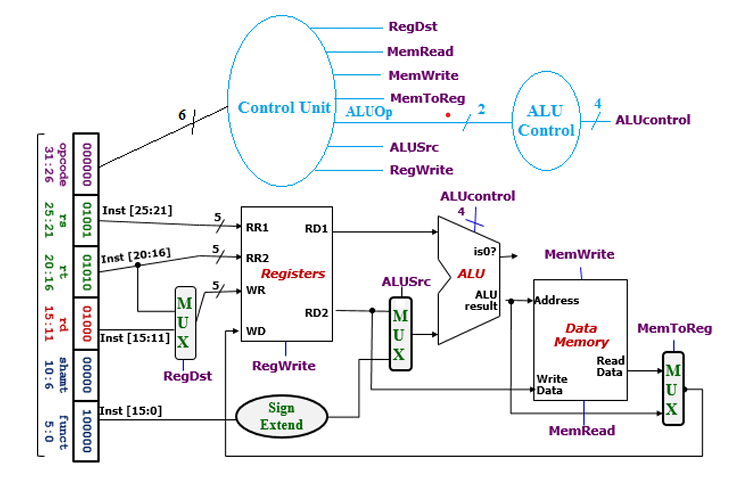

# MIPS Single-Cycle Datapath in Verilog

This project implements a **single-cycle datapath** in Verilog based on the classic **MIPS architecture**, following the structure shown in the diagram below:

## 📌 Overview

The design includes:

- **Control Unit**: Decodes instructions and generates control signals like `RegDst`, `ALUSrc`, `MemRead`, `MemWrite`, `MemToReg`, `RegWrite`, and `ALUOp`.
- **ALU Control**: Interprets `ALUOp` and `funct` fields to produce a 4-bit `ALUcontrol` signal.
- **ALU**: Performs arithmetic and logic operations; supports `isZero` output.
- **Registers**: Read/write register file with 2 read ports and 1 write port.
- **Sign Extend**: Extends 16-bit immediate values to 32 bits.
- **MUXes**: Select between register and immediate inputs, and between ALU and memory outputs.
- **Data Memory**: Handles memory read and write operations.

## 🛠 Modules

Each component is implemented in Verilog as an independent module. The design uses **structural modeling**, connecting all modules to form the complete datapath.

## 🚀 Simulation

Simulation is done using **ModelSim**. The testbench provides a sequence of instructions and validates the correct flow of data through the datapath.

## 📁 Project Structure

- `ALU/` – ALU, ALUControl
- `Registers/` – Register file
- `Control/` – Control unit
- `Memory/` – Data memory
- `MUX/` – Multiplexers
- `Top.v` – Full datapath connection
- `Testbench.v` – Testbench for simulation

---

> ✅ Contributions and suggestions are welcome!
